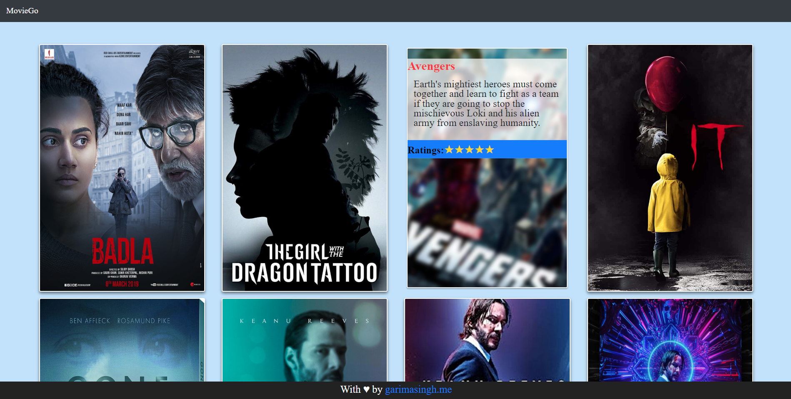

<h1 align="center">
    <a href="https://moviedo.netlify.app">MovieDo</a> "Get movie reviews at a click"
</h1>


[](https://github.com/garimasingh128/Hacktoberfest2020-MovieDo/blob/master/LICENSE)




<h4 align="center">
  A responsive movie review website "MovieDo" using JSON files & <a href="https://github.com/gatsbyjs/gatsby" target="_blank">Gatsby</a>.
</h4>

🎯 If you are a beginner, and looking for your first contribution, we are here to help. Just append your favorite movie, its rating, image and its short description in our 
https://github.com/garimasingh128/Hacktoberfest2020-MovieDo/tree/master/data/interviews and https://github.com/garimasingh128/Hacktoberfest2020-MovieDo/tree/master/data/images
and that counts as your first PR.

## Features
+ Uses [Bulma CSS](https://bulma.io/).
+ Minimalist Design.
+ 100% Responsive
+ Complete separation of data & code.
+ View it [live](https://moviedo.netlify.app)

## Inspiration and starter code
https://github.com/rmagon/gatsby-starter-interviews

## Contributing to Hacktoberfest 2020
 
 Open source is changing the world - one pull request at a time.
Hacktoberfest encourages participation in the open source community, which grows bigger every year. Complete the 2020 challenge and earn a limited edition T-shirt.

```
Hacktoberfest is open to everyone in our global community. Whether you’re new to development, a student, long-time contributor, event host, or company of any size, you can help drive growth of open source and make positive contributions to an ever-growing community. All backgrounds and skills levels are encouraged to complete the challenge.
```

#### 💻 Also, our website is open to contributions from both frontend and designer fellows who want to help us in making it bigger and better. 

## Instructions:
### 1. Register yourself for Hacktoberfest 2019
###### Link to register: https://hacktoberfest.digitalocean.com/


### 2. Getting Started
#### See Our Website at: https://hacktoberfest.netlify.com/


#### Move to Instructions by clicking on the <pre>START CONTRIBUTING</pre> button 


#### Read the Instructions and click Done at the end to move to the repository or <a href="https://github.com/garimasingh128/Hacktoberfest2020-MovieGo">click here</a> to head to the repository.


### 3. Star and Fork this Repository
###### You can star ⭐ and fork 🍽️ this repository on GitHub by navigating at the top of this repository.


###### GitHub repository URLs will reference both the username associated with the owner of the repository, as well as the repository name. For example, Open-Source-Contributors-JSS is the owner of the hacktoberfest repository, so the GitHub URL for this project is: 


###### When you’re on the main page for the repository, you’ll see a button to "Star" and “Fork” the repository on your upper right-hand side of the page, underneath your user icon.

### 3. Clone the Repository

###### To make your own local copy of the repository you would like to contribute to, let’s first open up a terminal window.

###### We’ll use the `git clone`  command along with the URL that points to your fork of the repository.

###### This URL will be similar to the URL above, except now it will end with `.git.` In the example above, the URL will look like this:
https://github.com/your-username/Hacktoberfest2019.git

###### You can alternatively copy the URL by using the green “Clone or download” button from your repository page that you just forked from the original repository page. Once you click the button, you’ll be able to copy the URL by clicking the binder button next to the URL:

###### Once we have the URL, we’re ready to clone the repository. To do this, we’ll combine the git clone command with the repository URL from the command line in a terminal window:

`git clone https://github.com/your-username/Hacktoberfest2019.git`


### 4. Create a New Branch

###### To create your branch, from your terminal window, change your directory so that you are working in the directory of the repository. Be sure to use the actual name of the repository (i.e. Hacktoberfest2019) to change into that directory.

#####    ` cd Hacktoberfest2019`


###### Now, we’ll create our new branch with the git branch command. Make sure you name it descriptively so that others working on the project understand what you are working on.

##### `git branch new-branch`

###### Now that our new branch is created, we can switch to make sure that we are working on that branch by using the git checkout command:

##### ` git checkout new-branch `


###### Once you enter the git `checkout` command, you will receive the following output:

######  `Output:` 
#####  `Switched to branch 'new-branch' `

 
###### At this point, you can now modify existing files or add new files to the project on your own branch.
###### Make sure you have read the <a href="https://github.com/Open-Source-Contributors-JSS/Hacktoberfest2019/blob/master/.github/ISSUE_TEMPLATE/contributing.md">contributing.md</a> before you start contributing such that you make remarkable and easily acceptable PRs.

#### Make Changes Locally. For ex- When making your beginner level contribution in this repository,find <a href="https://github.com/Open-Source-Contributors-JSS/Hacktoberfest2019/tree/master/beginner/json-files">git-commands.json</a> and add your favorite git command along with a two-three lines short description in the json file.

###### CAUTION: JSON files follow a certain format, do not forget to add a comma before you start editing your block and it's good if you append a comma after finishing your block.

#### Also, if you are interested in making intermediate or advanced level contributions, head to our <a href="https://github.com/Open-Source-Contributors-JSS/Hacktoberfest2019/tree/master/Intermediate">intermediate section</a> and make your mark.


###### Once you have modified existing files or added new files to the project, you can add them to your local repository, which you can do with the git add command. Let’s add the -A flag to add all changes that we have made:

##### ` git add -A ` or ` git add . `


###### Next, we’ll want to record the changes that we made to the repository with the git commit command.


###### The commit message is an important aspect of your code contribution; it helps the other contributors fully understand the change you have made, why you made it, and how significant it is. Additionally, commit messages provide a historical record of the changes for the project at large, helping future contributors along the way. Thus, you must ensure that you write a meaningful commit message. If in a confusion, refer to the good contribution guidelines included in the ##### ` contributing.md `


###### If you have a very short message, you can record that with the -m flag and the message in quotes:

###### ` Example: ` 
##### ` git commit -m "Updated Readme.md" `


###### At this point you can use the git push command to push the changes to the current branch of your forked repository:
###### ` Example:`
##### ` git push --set-upstream origin new-branch `


### 5. Update Local Repository

###### While working on a project alongside other contributors, it is important for you to keep your local repository up-to-date with the project as you don’t want to make a pull request for code that will cause conflicts. To keep your local copy of the code base updated, you’ll need to sync changes.

###### We’ll first go over configuring a remote for the fork, then syncing the fork.

### 6. Configure a Remote for the Fork

###### Next, you’ll have to specify a new remote upstream repository for us to sync with the fork. This will be the original repository that you forked from. you’ll have to do this with the git remote add command.

##### ` git remote add upstream https://github.com/Open-Source-Contributors-JSS/Hacktoberfest2019 `


###### In this example, // upstream // is the shortname we have supplied for the remote repository since in terms of Git, “upstream” refers to the repository that you cloned from. If you want to add a remote pointer to the repository of a collaborator, you may want to provide that collaborator’s username or a shortened nickname for the shortname.

### 7. Sync the Fork

###### Once you have configured a remote that references the upstream and original repository on GitHub, you are ready to sync your fork of the repository to keep it up-to-date.
###### To sync your fork, from the directory of your local repository in a terminal window, you’ll have to use the // git fetch // command to fetch the branches along with their respective commits from the upstream repository. Since you used the shortname “upstream” to refer to the upstream repository, you’ll have to pass that to the command:

##### ` git fetch upstream `

###### Switch to the local master branch of our repository:

##### ` git checkout master `

###### Now merge any changes that were made in the original repository’s master branch, that you will access through your local upstream/master branch, with your local master branch:

##### ` git merge upstream/master `

### 8. Create Pull Request

###### At this point, you are ready to make a pull request to the original repository.

###### Now navigate to your forked repository, and press the “New pull request” button on your left-hand side of the page.

## Hurray!!! You just got closer to completing your hacktoberfest challenge. 😃

## Happy?? Star ⭐ this Repo. 🤩

## Check your Hacktoberfest Contribution status at:
<a href="https://hacktoberfest.digitalocean.com/profile" target="blank">https://hacktoberfest.digitalocean.com/profile</a>

[](https://hacktoberfest.netlify.com/)
[](https://hacktoberfest.netlify.com/)
[](https://hacktoberfest.netlify.com/)
[](https://hacktoberfest.netlify.com/)


[](https://hacktoberfest.netlify.com/)&nbsp;
Voila!


## Quick Start

#### Start Developing

Navigate into your new site’s directory and start it up.

```sh
cd interviews
gatsby develop
```

#### Open the source code and start editing!

Your site is now running at `http://localhost:8000`!

Note: You'll also see a second link: `http://localhost:8000/___graphql`. This is a tool you can use to experiment with querying your data. Learn more about using this tool in the [Gatsby tutorial](https://www.gatsbyjs.org/tutorial/part-five/#introducing-graphiql).


#### To add more movies
1. Open the `data/interviews` directory in your code editor of choice.
2. Add another file, like the existing interview files eg: `movie_name.json`
3. Save your changes.
4. The movie card will appear on your homepage at `http://localhost:8000`!

## Deploy with Netlify

The project can run in any frontend web environment, but the quickest way to try it out is by running it on a pre-configured starter site with Netlify. Use the button below to build and deploy your own copy of the repository:

<a href="https://app.netlify.com/start/deploy?repository=https://github.com/garimasingh128/Hacktoberfest2020-MovieDo" target="_blank"></a>

1. After clicking that button, you’ll authenticate with GitHub and choose a repository name. 
2. Netlify will then automatically create a repository in your GitHub account with a copy of the files from the template.
3. It will build and deploy the new site on Netlify, bringing you to the site dashboard when the build is complete. 

## Folder Structure

```
└── data
    ├── images
    ├── interviews
    └── questions.json
└── src
    ├── components
    │   ├── footer
    │   ├── header
    │   ├── interview-grid
    │   ├── seo
    │   ├── share
    │   └── subscribe-form
    ├── images
    ├── pages
    └── templates
        ├── interview
        └── question
```

## 👬 Owner

<a href="https://github.com/garimasingh128"><br /><sub><b>Garima Singh</b></sub></a>

## License
The MIT License (MIT)

Copyright (c) 2020 Garima Singh

Permission is hereby granted, free of charge, to any person obtaining a copy
of this software and associated documentation files (the "Software"), to deal
in the Software without restriction, including without limitation the rights
to use, copy, modify, merge, publish, distribute, sublicense, and/or sell
copies of the Software, and to permit persons to whom the Software is
furnished to do so, subject to the following conditions:

The above copyright notice and this permission notice shall be included in all
copies or substantial portions of the Software.

THE SOFTWARE IS PROVIDED "AS IS", WITHOUT WARRANTY OF ANY KIND, EXPRESS OR
IMPLIED, INCLUDING BUT NOT LIMITED TO THE WARRANTIES OF MERCHANTABILITY,
FITNESS FOR A PARTICULAR PURPOSE AND NONINFRINGEMENT. IN NO EVENT SHALL THE
AUTHORS OR COPYRIGHT HOLDERS BE LIABLE FOR ANY CLAIM, DAMAGES OR OTHER
LIABILITY, WHETHER IN AN ACTION OF CONTRACT, TORT OR OTHERWISE, ARISING FROM,
OUT OF OR IN CONNECTION WITH THE SOFTWARE OR THE USE OR OTHER DEALINGS IN THE
SOFTWARE.
